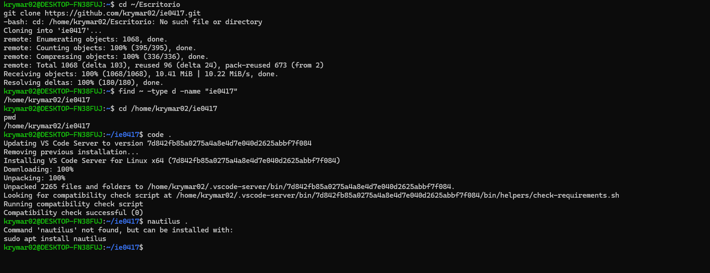
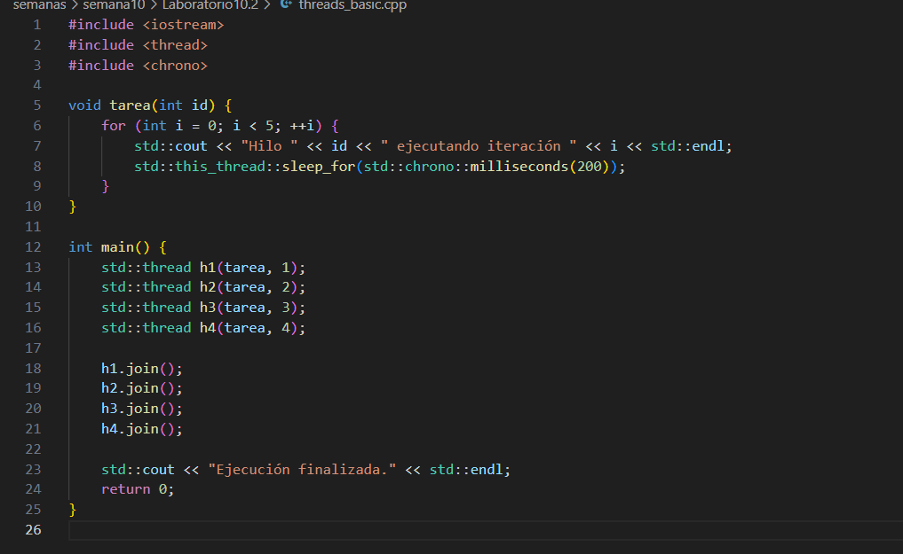
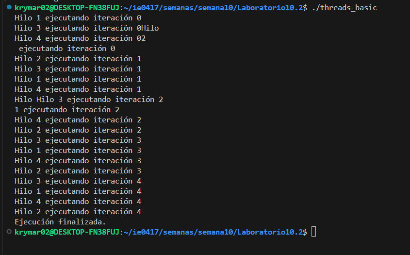

# Semana 10  
**Kryssia Martínez**  
**Laboratorio 10**  
**Tema:** Laboratorio de programación paralela y concurrente en C++  

---

## Índice
- [Preparación del laboratorio 10](#preparación-del-laboratorio-10)
- [Conceptos](#conceptos)
  - [Fase 1: Fundamentos prácticos de concurrencia](#fase-1-fundamentos-prácticos-de-concurrencia)
  - [Fase 2: Sincronización y exclusión mutua](#fase-2-sincronización-y-exclusión-mutua)
  - [Fase 3: Mecanismos avanzados y análisis de rendimiento](#fase-3-mecanismos-avanzados-y-análisis-de-rendimiento)
  - [Fase 4: Análisis conceptual y reflexivo](#fase-4-análisis-conceptual-y-reflexivo)
- [Ejecución con Docker](#ejecución-con-docker)

---

## Preparación del laboratorio 10

- Primero, se clonó el repositorio para trabajar en la computadora.



---

## Conceptos

### Fase 1: Fundamentos prácticos de concurrencia

**Actividad 1: Creación de hilos independientes**  
**Instrucción:**  
Implementar un programa simple con 4 hilos que impriman mensajes en consola de forma intercalada.  
**Archivo creado:** `threads_basic.cpp`

**Imagen del código**  
  

---

### Preguntas y desarrollo

**Imagen de salida**  


1. ¿Qué patrón de ejecución observas en la salida?  
- En la salida se ve de manera **intercalada** entre los distintos hilos, como se muestra en la imagen. Los mensajes de los hilos no salen en un orden fijo y a veces se mezclan dentro de la misma línea, porque todos los hilos escriben en la consola al mismo tiempo. Esto muestra que los hilos se ejecutan concurrentemente, pero no de manera determinista.

2. ¿Existe una forma de controlar el orden de ejecución sin cambiar la lógica principal?  
- Pienso que no hay una forma fácil de que los hilos siempre salgan en el mismo orden sin usar sincronización. Pero se puede usar un std::mutex para que las líneas no se mezclen, o un std::condition_variable para dar turnos a los hilos y que se muestre diferente la salida. Ejecutarlos uno por uno garantiza orden, pero ya no sería concurrente.

---

### Fase 2: Sincronización y exclusión mutua

**Actividad 2: Simulación de una variable compartida**  
**Instrucción:**  
Implementar un contador compartido entre varios hilos sin protección, y luego corregirlo usando `std::mutex`.  
**Archivo creado:** `contador_compartido.cpp`

**Imagen del código con mutex**  


**Archivo creado:** `contador_compartido2.cpp`

**Imagen del código sin mutex**  


---

### Preguntas y desarrollo

1. Ejecutar el código con y sin `mutex`, comparar resultados.  

**Imagen de salida del código con mutex**  

  

**Imagen de salida del código sin mutex**  
  

**Resultados de la comparación**  
- Con mutex: El contador siempre termina en 3000, que es el valor correcto.  
- Sin mutex: El contador **podría terminar en un número menor a 3000** debido a condiciones de carrera. En este caso, como solo usamos 3 hilos y 1000 iteraciones, el resultado terminó siendo 3000 por coincidencia. 

2. Explicar por qué ocurre el resultado incorrecto en la versión sin sincronización.  
- El problema aparece cuando varios hilos leen y escriben la variable `contador` al mismo tiempo, sobrescribiendo incrementos antes de completarse. Esto se llama **condición de carrera**.

3. Estimar cuántos “context switch” pueden estar ocurriendo (de manera conceptual).  
- En este caso, cada cambio de ejecución entre hilos es un **context switch**. Con muchas iteraciones y varios hilos, estos switches ocurren muchas veces y afectan cómo se mezclan las operaciones sobre lo que seria la variable compartida.


---

### Actividad 3: Variables de condición (modelo Productor-Consumidor)

**Instrucción:**  
Implementar el clásico problema Productor-Consumidor con buffer limitado.  
**Archivo creado:** `productor_consumidor.cpp`

**Imagen del código**  
*(insertar aquí la imagen del código)*  

---

### Preguntas y desarrollo

1. ¿Qué ocurriría si se elimina el `cv_productor.wait`?  
2. ¿Por qué se usa `unique_lock` y no `lock_guard` en este caso?  
3. ¿Qué garantiza `cv_consumidor.notify_all()`?  

**Imagen de salida**  
*(insertar aquí la imagen de la salida)*  

---

### Fase 3: Mecanismos avanzados y análisis de rendimiento

**Actividad 4: Uso de semáforos y barreras**  
**Instrucción:**  
Implementar un programa que utilice `std::counting_semaphore` para controlar el acceso concurrente a un recurso limitado (por ejemplo, un "pool de conexiones").  
Luego, añadir una `std::barrier` para sincronizar el final de cada ronda.  
**Archivo creado:** *(insertar nombre del archivo)*  

**Imagen del código**  
*(insertar aquí la imagen del código)*  

**Imagen de salida**  
*(insertar aquí la imagen de la salida)*  

---

**Actividad 5: Experimento de rendimiento**  
**Instrucción:**  
Crear un script que ejecute la versión `productor_consumidor` con distintos parámetros.  
**Archivo creado:** `test_run.sh`

**Imagen del código**  
*(insertar aquí la imagen del código)*  

---

### Preguntas y desarrollo

1. Registrar los tiempos de ejecución para cada configuración.  
2. Elaborar un gráfico simple (puede hacerse con Excel o Python) que muestre el tiempo de ejecución total frente al número de hilos.  
3. Explicar por qué el rendimiento no escala linealmente con el número de hilos.  

**Imagen de salida**  
*(insertar aquí la imagen de la salida o del gráfico)*  

---

### Fase 4: Análisis conceptual y reflexivo

**Preguntas y desarrollo**

1. ¿Cuál es la diferencia entre paralelismo y concurrencia según tus resultados experimentales?  
2. ¿Qué ventajas y desventajas observas al aumentar el número de hilos?  
3. ¿Qué mecanismos fueron necesarios para evitar condiciones de carrera?  
4. ¿Qué impacto tuvieron los mecanismos de sincronización en el rendimiento?  
5. ¿Qué aprendiste sobre el costo de crear y administrar hilos?  
6. ¿Cómo se podría optimizar el balance entre granularidad y rendimiento?  

---

## Ejecución con Docker

**Imagen del código**  
*(insertar aquí la imagen del código o configuración de Docker)*  

**Comandos**

```bash

**Imagen de salida**  
*(insertar aquí la imagen de la salida o del gráfico)*  


