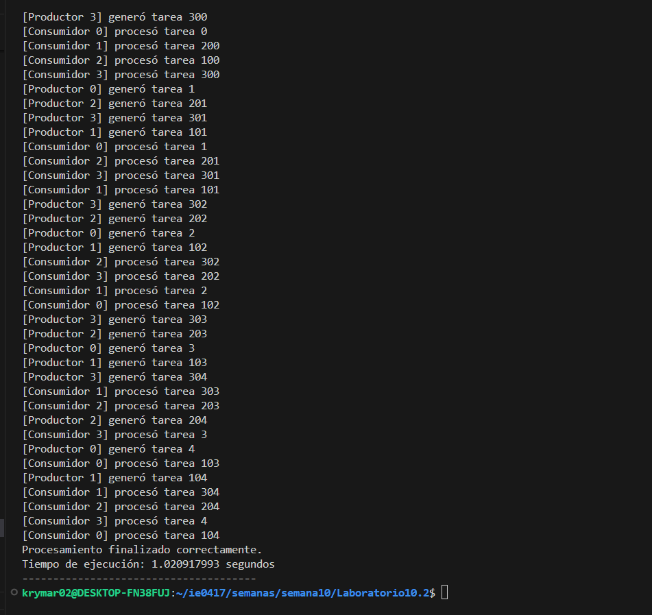

# Semana 10  
**Kryssia Martínez**  
**Laboratorio 10**  
**Tema:** Laboratorio de programación paralela y concurrente en C++  

---

## Índice
- [Preparación del laboratorio 10](#preparación-del-laboratorio-10)
- [Conceptos](#conceptos)
  - [Fase 1: Fundamentos prácticos de concurrencia](#fase-1-fundamentos-prácticos-de-concurrencia)
  - [Fase 2: Sincronización y exclusión mutua](#fase-2-sincronización-y-exclusión-mutua)
  - [Fase 3: Mecanismos avanzados y análisis de rendimiento](#fase-3-mecanismos-avanzados-y-análisis-de-rendimiento)
  - [Fase 4: Análisis conceptual y reflexivo](#fase-4-análisis-conceptual-y-reflexivo)
- [Ejecución con Docker](#ejecución-con-docker)

---

## Preparación del laboratorio 10

- Primero, se clonó el repositorio para trabajar en la computadora.


---

## Conceptos

### Lo que aprendí

- **Concurrencia**: Ejecución de varias tareas que pueden convinarse en el tiempo, pero no necesariamente al mismo instante.  
- **Paralelismo**: Ejecución simultánea de varias tareas en distintos núcleos de CPU.  
- **Hilos (Threads)**: Unidades de ejecución que permiten tareas simultáneas dentro de un mismo programa.  
- **Condición de carrera (Race Condition)**: Ocurre cuando varios hilos acceden y modifican datos compartidos sin sincronización.  
- **Mutex (`std::mutex`)**: Es un mecanismo que garantiza acceso exclusivo a recursos compartidos, evitando condiciones de carrera.  
- **Variables de condición (`std::condition_variable`)**: Son las que permiten que los hilos esperen hasta que se cumpla cierta condición antes de continuar.  
- **Buffer limitado / Productor-Consumidor**: Es un modelo clásico donde productores agregan y consumidores procesan datos, coordinando accesos.  
- **Tiempo de ejecución y escalabilidad**: Aumentar hilos no siempre mejora rendimiento linealmente; la sincronización y la administración de hilos generan sobrecarga.  
- **Docker**: Es el que proporciona un entorno reproducible para compilar y ejecutar programas concurrentes de forma consistente como se evidencia en este lab.


---

### Fase 1: Fundamentos prácticos de concurrencia

**Actividad 1: Creación de hilos independientes**  
- **Instrucción:**  
Implementar un programa simple con 4 hilos que impriman mensajes en consola de forma intercalada.  
- **Archivo creado:** `threads_basic.cpp`

**Imagen del código**  
  

---

### Preguntas y desarrollo

**Imagen de salida**  


1. ¿Qué patrón de ejecución observas en la salida?  
- En la salida se ve de manera **intercalada** entre los distintos hilos, como se muestra en la imagen. Los mensajes de los hilos no salen en un orden fijo y a veces se mezclan dentro de la misma línea, porque todos los hilos escriben en la consola al mismo tiempo. Esto muestra que los hilos se ejecutan concurrentemente, pero no de manera determinista.

2. ¿Existe una forma de controlar el orden de ejecución sin cambiar la lógica principal?  
- Pienso que no hay una forma fácil de que los hilos siempre salgan en el mismo orden sin usar sincronización. Pero se puede usar un std::mutex para que las líneas no se mezclen, o un std::condition_variable para dar turnos a los hilos y que se muestre diferente la salida. Ejecutarlos uno por uno garantiza orden, pero ya no sería concurrente.

---

### Fase 2: Sincronización y exclusión mutua

**Actividad 2: Simulación de una variable compartida**  
- **Instrucción:**  
Implementar un contador compartido entre varios hilos sin protección, y luego corregirlo usando `std::mutex`

- **Archivo creado:** `contador_compartido.cpp`

**Imagen del código con mutex**  


- **Archivo creado:** `contador_compartido2.cpp`

**Imagen del código sin mutex**  


---

### Preguntas y desarrollo

1. Ejecutar el código con y sin `mutex`, comparar resultados.  

**Imagen de salida del código con mutex**  

  

**Imagen de salida del código sin mutex**  
  

- **Resultados de la comparación**  
  - Con mutex: El contador siempre termina en 3000, que es el valor correcto.  
  - Sin mutex: El contador **podría terminar en un número menor a 3000** debido a condiciones de carrera. En este caso, como solo usamos 3 hilos y 1000 iteraciones, el resultado terminó siendo 3000 por coincidencia. 

2. Explicar por qué ocurre el resultado incorrecto en la versión sin sincronización.  
- El problema aparece cuando varios hilos leen y escriben la variable `contador` al mismo tiempo, sobrescribiendo incrementos antes de completarse. Esto se llama **condición de carrera**.

3. Estimar cuántos “context switch” pueden estar ocurriendo (de manera conceptual).  
- En este caso, cada cambio de ejecución entre hilos es un **context switch**. Con muchas iteraciones y varios hilos, estos switches ocurren muchas veces y afectan cómo se mezclan las operaciones sobre lo que seria la variable compartida.


---

### Actividad 3: Variables de condición (modelo Productor-Consumidor)

- **Instrucción:**  
Implementar el clásico problema Productor-Consumidor con buffer limitado. 

- **Archivo creado:** `productor_consumidor.cpp`

**Imagen del código**  
 


---
**Imagen de salida**  
  

---
### Preguntas y desarrollo

1. ¿Qué ocurriría si se elimina el `cv_productor.wait`?  
- Si quitamos `cv_productor.wait`, los productores seguirían intentando agregar tareas al buffer sin esperar a que haya espacio.  
Lo que puede causar que el buffer se llene más allá de su límite (`BUFFER_SIZE`) o que los productores tengan que usar lógica adicional para no sobrescribir datos. Entomnces, **el buffer ya no estaría controlado**, y podría generar errores o resultados inesperados.

2. ¿Por qué se usa `unique_lock` y no `lock_guard` en este caso?  
- Se usa `unique_lock` porque permite **liberar y volver a adquirir el mutex automáticamente**, lo cual es necesario para usar `std::condition_variable::wait`. Mientras que `lock_guard` solo bloquea y desbloquea al salir del scope, y no funciona con `wait`.

3. ¿Qué garantiza `cv_consumidor.notify_all()`?  
- En este caso, `cv_consumidor.notify_all()` se encarga de despertar a todos los hilos consumidores que estén esperando. Garantiza que **si hay tareas en el buffer**, los consumidores puedan procesarlas inmediatamente. Sin esto, los consumidores podrían quedarse esperando aunque haya tareas disponibles.

---

### Fase 3: Mecanismos avanzados y análisis de rendimiento

**Actividad 4: Uso de semáforos y barreras**  
- **Instrucción:**  
Implementar un programa que utilice `std::counting_semaphore` para controlar el acceso concurrente a un recurso limitado (por ejemplo, un "pool de conexiones"). Luego, añadir una `std::barrier` para sincronizar el final de cada ronda.  

- **Archivo creado:** *semaforo.cpp*  

**Imagen del código**  


**Imagen de salida**  


---

**Actividad 5: Experimento de rendimiento**  
- **Instrucción:**  
Crear un script que ejecute la versión `productor_consumidor` con distintos parámetros.  
- **Archivo creado:** `test_run.sh`

**Imagen del código**  
  

---

**Imagen de salida**  
 

 





### Preguntas y desarrollo

1. Registrar los tiempos de ejecución para cada configuración.  

| Productores | Consumidores | Tiempo de ejecución (s) |
|------------|--------------|-------------------------|
| 1          | 1            | 1.0196                  |
| 1          | 2            | 0.8217                  |
| 1          | 4            | 0.8165                  |
| 2          | 1            | 2.0349                  |
| 2          | 2            | 1.0168                  |
| 2          | 4            | 0.8212                  |
| 4          | 1            | 4.0526                  |
| 4          | 2            | 2.0271                  |
| 4          | 4            | 1.0209                  |


2. Elaborar un gráfico simple (puede hacerse con Excel o Python) que muestre el tiempo de ejecución total frente al número de hilos. 

- Se generó un gráfico en Python usando `matplotlib` con la información anterior.  

- **Archivo creado:** `grafico_tiempos.py` en python


- **Gráfico**


3. Explicar por qué el rendimiento no escala linealmente con el número de hilos.  

- Aunque se aumente el número de productores y consumidores, el tiempo de ejecución no mejora de forma lineal. Esto sucede porque los hilos comparten el mismo buffer limitado, entonces algunos productores deben esperar cuando el buffer está lleno y los consumidores cuando está vacío. Luego, el uso de mutex y condition_variable genera bloqueos y esperas que consumen tiempo de CPU. También hay cambios de contexto que el sistema operativo realiza para alternar entre hilos, entonces hace que no todos se ejecuten al mismo tiempo. El hardware tiene un número limitado de núcleos, cuando hay más hilos que núcleos, algunos hilos esperan que les toque y asi se reduce la mejora en el rendimiento. Entonces aunque se agreguen más hilos, los bloqueos y la contención impiden que el rendimiento escale de forma lineal y se refleja en los tiempos de ejecución que se obtuvo, por ejemplo, con 1 productor y 1 consumidor tarda 1.02 s, pero con 4 productores y 4 consumidores solo se reduce a 1.02 s, no a una cuarta parte como sería lo esperado.

---

### Fase 4: Análisis conceptual y reflexivo

**Preguntas y desarrollo**

1. ¿Cuál es la diferencia entre paralelismo y concurrencia según tus resultados experimentales?  

- Según los resultados del laboratorio, la concurrencia se refiere a manejar varias tareas que se superponen en el tiempo, como por ejemplo varios productores y consumidores alternándose para usar el buffer. El paralelismo ocurre cuando varias tareas realmente se ejecutan al mismo tiempo, como por ejemplo en diferentes núcleos de CPU. En las pruebas de este lab, vi que aunque aumentan los hilos, muchas veces la ejecución no era simultánea, lo que indica que era más concurrencia que paralelismo real.

2. ¿Qué ventajas y desventajas observas al aumentar el número de hilos?  

- **Ventajas**: Permite que más tareas se gestionen al mismo tiempo, lo que mejora la utilización del CPU y reduce el tiempo de espera de cada tarea individual.  
- **Desventajas**: Aumentar hilos excesivamente puede generar sobrecarga de administración y más cambios de contexto, lo que puede disminuir el rendimiento y causar saturación del buffer.


3. ¿Qué mecanismos fueron necesarios para evitar condiciones de carrera?  

- Se usó `std::mutex` y `std::condition_variable` para proteger el acceso al buffer compartido y coordinar productores y consumidores. Esto ayuda a que no se den conflictos al leer/escribir datos compartidos y que los hilos esperen su turno de forma correcta.


4. ¿Qué impacto tuvieron los mecanismos de sincronización en el rendimiento?  

- La sincronización trajo retrasos como que los hilos deben esperar al mutex o la condición, lo que reduce el paralelismo efectivo. Esto explica por qué el rendimiento no escala linealmente al aumentar hilos, en consecuencia se genera mayor costo de la compu.


5. ¿Qué aprendiste sobre el costo de crear y administrar hilos?  

-  Bueno que crear hilos consume bastante tiempo y recursos, a veces no se ejecutan bien ni terminan bien. Luego que hilos adicionales aumentan la complejidad de administración y pueden provocar más cambios de contexto, especialmente si hay más hilos que núcleos disponibles, lo que puede incluso ralentizar la ejecución como fue en mi caso, en una de las imágenes no termina de ejecutarse por el tiempo de espera, mientras que en otra manipulé una archivo para que finalizara de manera correcta. 


6. ¿Cómo se podría optimizar el balance entre granularidad y rendimiento?  

- Para optimizar ese balance, se puede usar un número de hilos cercano al número de núcleos disponibles y también dividir el trabajo en tareas suficientemente grandes para mejorar el costo de sincronización. Se puede evitar usar hilos excesivamente finos o demasiadas esperas, para poder mejorar el balance entre la eficiencia y la concurrencia y los tiempos.


---

## Ejecución con Docker

**Imagen del código Docker**

- Para la parte de docker utilice este.

  

- **Comandos**

  ```bash
  docker run --rm laboratorio_concurrencia ./lab 1 2 5

  ```

- **Resultados**  

  - **Imagen**: Basada en `ubuntu:22.04`, con `g++`, `cmake` y `make` instalados.  
  - **Código**: Se copia y compila `productor_consumidor.cpp` dentro del contenedor generando el ejecutable `lab`.  
  - **Ejecución**: `docker run --rm laboratorio_concurrencia ./lab X Y Z` corre el programa aislado, mostrando productores generando tareas y consumidores procesándolas.  
  - **Beneficios**: Entorno consistente, sin conflictos locales, permite repetir experimentos con distintos hilos.  
  - **Resultado**: Se observa la concurrencia en acción y se registran los tiempos de ejecución para análisis de rendimiento.


