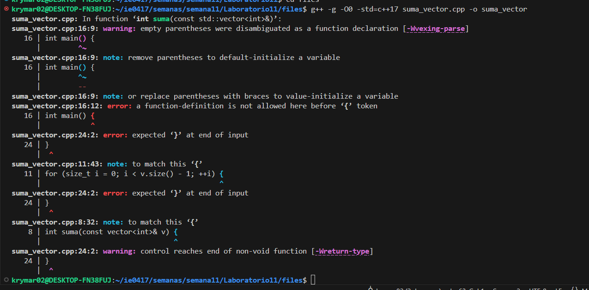

# Semana 11  
**Kryssia Martínez**  
**Laboratorio 11**  
**Tema:** Laboratorio Depuración en C++ con gdb, Valgrind y Sanitizers 

---

## Índice
- [Preparación del laboratorio 10](#preparación-del-laboratorio-10)
- [Conceptos](#conceptos)
  - [Fase 1: Fundamentos prácticos de concurrencia](#fase-1-fundamentos-prácticos-de-concurrencia)
  - [Fase 2: Sincronización y exclusión mutua](#fase-2-sincronización-y-exclusión-mutua)
  - [Fase 3: Mecanismos avanzados y análisis de rendimiento](#fase-3-mecanismos-avanzados-y-análisis-de-rendimiento)
  - [Fase 4: Análisis conceptual y reflexivo](#fase-4-análisis-conceptual-y-reflexivo)
- [Ejecución con Docker](#ejecución-con-docker)

---

## Preparación del laboratorio 10

- Primero, se actualizó el repositorio para trabajar en la computadora.

---

## Conceptos

### Lo que aprendí

---

### Fase 1: Fundamentos prácticos de depuración

**Actividad 1:  Exploración con gdb**  
- **Instrucción:**  
Implementar un programa que contenga errores de lógica y de ejecución, y utilizar gdb para analizarlo paso a paso.  
- **Archivo creado:** `threads_basic.cpp`

**Imagen del código**  
  

---

- Desarrollo de tareas:

1. Compilar el programa en modo debug con símbolos de depuración:
g++ -g -O0 -std=c++17 suma_vector.cpp -o suma_vector

**Imagen de la compilación**  
  

2. Ejecutar bajo gdb:
gdb ./suma_vector

**Imagen de la ejecución**  
  

3. Usar los comandos run, next, step, print, bt e info locals para ubicar los errores.

**Busqueda de errores**  
 

4. Explicar las causas del error de ejecución y el error lógico.

5. Corregir ambos errores y validar la salida correcta (suma = 10).

**Corrección del código**  
 

**Imagen de salida**  

---

### Preguntas y desarrollo

1. ¿Qué tipo de error genera el fallo de ejecución?
- 

2. ¿Qué comando permite identificar la línea exacta donde ocurre el fallo?
-

3. ¿Qué diferencia existe entre los comandos next y step en gdb?
- 

---

### Fase 2:  Detección de errores de memoria

**Actividad 2: Diagnóstico con AddressSanitizer y Valgrind**  
- **Instrucción:**  
Analizar un programa con errores de asignación y fugas de memoria utilizando AddressSanitizer (ASan) y Valgrind/Memcheck.

- **Archivo creado:** `contador_compartido.cpp`

**Imagen del código **  

- **Archivo creado:** `contador_compartido2.cpp`

---

- Desarrollo de tareas:

1. Compilar con AddressSanitizer:
clang++ -g -O0 -fsanitize=address -fno-omit-frame-pointer
buffers.cpp -o buffers
./buffers

**Imagen de la compilación**  
  

2. Ejecutar con Valgrind:
valgrind --leak-check=yes --track-origins=yes
--show-leak-kinds=all ./buffers

**Imagen de la ejecución**  
  

3. Registrar los errores detectados y sus causas.
- 

**Busqueda de errores**  
 

4. Corregir el código (agregar espacio adecuado, evitar accesos inválidos y liberar memoria).

**Corrección del código**  
 

5. Validar la ejecución sin errores en ASan y Valgrind.

**Corrección del código**  
 

**Imagen de salida**  

---

### Preguntas y desarrollo

1. ¿Qué tipo de error detectó AddressSanitizer primero?
- 

2. ¿Cuál fue la causa de la fuga de memoria?
-

3. ¿Por qué es importante compilar con la opción -g?
- 

---
### Fase 3:  Análisis de concurrencia

**Actividad 3: Detección de condiciones de carrera**  
