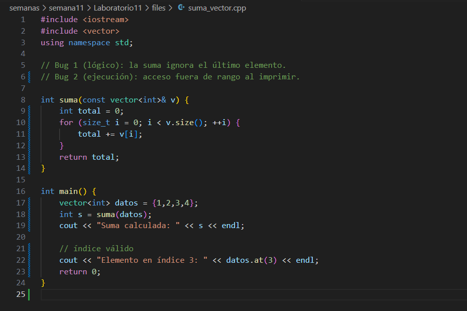

# Semana 11  
**Kryssia Martínez**  
**Laboratorio 11**  
**Tema:** Laboratorio Depuración en C++ con gdb, Valgrind y Sanitizers 

---

## Índice
- [Preparación del laboratorio 11](#preparación-del-laboratorio-11)
- [Conceptos](#conceptos)
  - [Fase 1: Fundamentos prácticos de depuración](#fase-1-fundamentos-prácticos-de-depuración)
  - [Fase 2: Detección de errores de memoria](#fase-2-detección-de-errores-de-memoria)
  - [Fase 3: Análisis de concurrencia](#fase-3-análisis-de-concurrencia)
  - [Fase 4: Integración y automatización](#fase-4-integración-y-automatización)
  - [Fase 5: Análisis conceptual y reflexivo](#fase-5-análisis-conceptual-y-reflexivo)
- [Ejecución con Docker](#ejecución-con-docker)

---

## Preparación del laboratorio 11

- Primero, se actualizó el repositorio para trabajar en la computadora.


---

## Conceptos

### Lo que aprendí


---

### Fase 1: Fundamentos prácticos de depuración

**Actividad 1:  Exploración con gdb**  
- **Instrucción:**  
Implementar un programa que contenga errores de lógica y de ejecución, y utilizar gdb para analizarlo paso a paso.  
- **Archivo creado:** `suma_vector.cpp`

**Imagen del código** 

  

---

- Desarrollo de tareas:

1. Compilar el programa en modo debug con símbolos de depuración:
g++ -g -O0 -std=c++17 suma_vector.cpp -o suma_vector

2. Ejecutar bajo gdb:
gdb ./suma_vector

**Imagen de la compilación y ejecución**  

  

3. Usar los comandos run, next, step, print, bt e info locals para ubicar los errores.

**Busqueda de errores**  

 

- En la depuración en **gdb**, usé `break main` para poner un *breakpoint* al inicio de `main` y que el programa se detuviera ahí, para que avance despacio. Luego usé `catch throw` para que se pare justo cuando se lance una excepción C++, así se puede ver el fallo cuando sucede. Después, con `run` arranqué el programa para poder localizar el problema.  

- Cuando **gdb** se detuvo en `main`, usé `list` para ver el código con números de línea. Busqué la línea con `cout << "Suma calculada..."` y la que tiene `datos.at(4)`. Puse un *breakpoint* en la línea de `datos.at(4)` con `(gdb) break N` y continué la ejecución con `(gdb) continue`.  

- Para inspeccionar las variables antes del fallo, vi los valores usando `print s` (6 en este caso), luego el tamaño del vector con `print datos.size()` y los elementos con `print datos`.  

- Casi al final, usé `(gdb) bt` (*backtrace*) para ver la pila y la línea donde se lanzó la excepción, también `(gdb) info locals` para ver las variables locales del *frame* donde ocurrió el fallo, y `(gdb) print datos.size()` donde se confirma por qué pasa el error.  

- Por último, se muestra que antes `bt` e `info locals` decían "No stack" / "No frame" porque se usaron después de que el programa ya se había terminado. Con `catch throw` activo, **gdb** se detiene justo cuando se lanza la excepción, en ese momento `bt` e `info locals` sí brindan información útil.

**Parte 1 de la ejecución con gdb**  

 

**Parte 2 de la ejecución con gdb**  

 

**Parte 3 de la ejecución con gdb**  

 

**Parte 4 de la ejecución con gdb**  

 


4. Explicar las causas del error de ejecución y el error lógico.

- **Error lógico:** La función `suma` tenía un bucle `for` con la condición `i < v.size() - 1`, con eso se ignoraba el último elemento del vector. Entonces cuando se hacia la suma daba 6 en lugar de 10.

- **Error de ejecución:** Se intentaba acceder a `datos.at(4)` en un vector de tamaño 4, ahi se generó una excepción `std::out_of_range` porque el índice 4 no existe como pudimos observar. Entonces el programa se veia obligado a detenerse de manera incorrecta.

5. Corregir ambos errores y validar la salida correcta (suma = 10).

- Se realizó la corrección del c ódigo, lo que da una salida correcta.

**Corrección del código**  

 

**Imagen de salida**  


---

### Preguntas y desarrollo

1. ¿Qué tipo de error genera el fallo de ejecución?
- Se genera una excepción std::out_of_range por intentar acceder a un índice inválido del vector.

2. ¿Qué comando permite identificar la línea exacta donde ocurre el fallo?
- `bt` (backtrace) en gdb, que muestra la pila y la línea donde se lanza la excepción.

3. ¿Qué diferencia existe entre los comandos next y step en gdb?
- `next` es el que ejecuta la siguiente línea de código pero sin entrar en funciones llamadas. 
- mientras que `step` ejecuta la siguiente línea de código y entra en cualquier función llamada en esa línea.

---

### Fase 2:  Detección de errores de memoria

**Actividad 2: Diagnóstico con AddressSanitizer y Valgrind**  
- **Instrucción:**  
Analizar un programa con errores de asignación y fugas de memoria utilizando AddressSanitizer (ASan) y Valgrind/Memcheck.

- **Archivo creado:** `buffers.cpp`

**Imagen del código**  


---

- Desarrollo de tareas:

1. Compilar con AddressSanitizer:
clang++ -g -O0 -fsanitize=address -fno-omit-frame-pointer
buffers.cpp -o buffers
./buffers

**Imagen de la compilación**  


**Imagen de los errores 1**  


**Imagen de los errores 2**  


2. Ejecutar con Valgrind:
valgrind --leak-check=yes --track-origins=yes
--show-leak-kinds=all ./buffers

**Imagen de la ejecución**  

  

**Imagen de los errores**  


3. Registrar los errores detectados y sus causas.
**ASan y Valgrind:**

- **Heap-buffer-overflow (ASan y Valgrind):** `copiar()` hacía `malloc(n)` y luego `memcpy(buf, src, n+1)`. La copia de `n+1` bytes sobreescribía el byte siguiente al bloque asignado (falta reservar espacio para el terminador '\0').

- **Use-after-free (Valgrind):** en `main` se llamó `free(a)` y luego se usó `a` con `cout`, provocando lecturas inválidas en memoria ya liberada.

- **Memory leak (Valgrind):** `malloc(128)` en `main` no se liberó (habia una fuga de 128 bytes reportada como "definitely lost").

- Entones, se debe reservar `n+1` bytes para el buffer, no usar punteros tras `free` (asignar `nullptr`) y liberar toda memoria asignada con `free`.
 

4. Corregir el código (agregar espacio adecuado, evitar accesos inválidos y liberar memoria).

**Corrección del código**  

 


5. Validar la ejecución sin errores en ASan y Valgrind.


**Salida con ASan**  

 

**Salida con Valgrind**  


---

### Preguntas y desarrollo

1. ¿Qué tipo de error detectó AddressSanitizer primero?
- Detectó un **heap-buffer-overflow**, ya que se estaba copiando `n+1` bytes, incluyendo el carácter `'\0'` a un buffer que solo tenía `n` bytes reservados con `malloc(n)`.


2. ¿Cuál fue la causa de la fuga de memoria?
- Lo que sucedió fué que se reservó memoria con `malloc(128)` para la variable `leak`, pero **nunca se liberó** con `free(leak)` antes de finalizar el programa, por lo que Valgrind lo reportó como **definitely lost**.

3. ¿Por qué es importante compilar con la opción -g?
- Porque añade **símbolos de depuración** al ejecutable, lo que permite que herramientas como AddressSanitizer, Valgrind y gdb muestren la **línea exacta** donde ocurre el error y un **backtrace comprensible**, que facilita encontrar el problema.  

---
### Fase 3:  Análisis de concurrencia

**Actividad 3: Detección de condiciones de carrera**  
- **Instrucción:**  
Analizar un programa con accesos concurrentes a una variable compartida sin sincronización. Usar ThreadSanitizer y Helgrind para detectar el problema y luego corregirlo.

- **Archivo creado:** `race.cpp`

**Imagen del código**  


---

- Desarrollo de tareas:

1. Compilar con ThreadSanitizer:
clang++ -g -O1 -fsanitize=thread -std=c++17 race.cpp -o
race -lpthread
./race

**Imagen de la compilación 1**  

 


2. Ejecutar con Helgrind:
valgrind --tool=helgrind ./race

**Imagen de la ejecución**  

  

3. Registrar el diagnóstico de ambas herramientas.

**Diagnóstico de errores con ThreadSanitizer 1:**  

 

**Diagnóstico de errores con ThreadSanitizer 2:**  

 

**Diagnóstico de errores con Helgrind 1:**  


**Diagnóstico de errores con Helgrind 2:**  


**Diagnóstico de errores con Helgrind 3:**  


**Diagnóstico de errores:**
- ThreadSanitizer (TSan):

  - **Error detectado:** `data race`.
  - **Ubicación:** `contador++` → `race.cpp:10`.
  - **Acceso reportado:** escritura concurrente (**Write of size 4**).
  - **Descripción del problema:**
    - Dos hilos (`t1` y `t2`) modifican la misma variable global `contador` sin sincronización.
    - TSan muestra los *stack traces* identificando qué hilos acceden a la misma dirección al mismo tiempo.

- Helgrind (Valgrind):

  - **Error detectado:** `Possible data race`.
  - **Ubicación:** en accesos a la dirección asociada a `contador`.  
    - Se da un conflicto entre operaciones **read/write y write/write**
  - **Mensajes clave:**
    - “Locks held: none”, no hay mecanismos de sincronización. Y reporta múltiples accesos concurrentes durante la ejecución.

4. Corregir el código usando std::mutex o std::atomic<int>.

**Corrección del código**

 

**Imagen de salida**


---

### Preguntas y desarrollo

1. ¿Qué tipo de acceso detecta ThreadSanitizer como data race?
- Detecta un acceso **concurrente** en la **misma dirección de memoria** sin sincronización, donde **al menos uno es escritura**.

2. ¿Por qué Helgrind tiene un mayor costo de ejecución?
- Porque instrumenta y **rastrea exhaustivamente** todos los accesos a memoria y las relaciones de sincronización (**happens-before**), lo cual introduce **mucha sobrecarga** en tiempo de ejecución comparado con la ejecución normal del programa.

3. ¿Qué ventajas tiene usar std::atomic frente a std::mutex?
- Para operaciones simples como un contador:
     - **Evita bloqueos** (no hay `lock/unlock`).
     - Es **más rápido** y **más escalable** con varios hilos.
     - Es **más simple** de usar en incrementos/lecturas.
   - Mientras que `std::mutex` es mejor cuando se requiere proteger **secciones críticas más grandes** o **múltiples operaciones** que deben ejecutarse de forma atómica en conjunto.

---

### Fase 4:  Integración y automatización

**Actividad 4:  Makefile y perfiles de análisis**  
- **Instrucción:**  
Crear un Makefile que automatice la compilación y ejecución con los diferentes perfiles de depuración.

- **Archivo creado:** `Makefile`

**Imagen del Makefile 1**


**Imagen del Makefile 2**


**Imagen del Makefile 3**


**Imagen de la ejecución con make 1**


**Imagen de la ejecución con make 2**  


---
### Fase 5:  Análisis conceptual y reflexivo

**Preguntas de análisis:**  
1. ¿Qué diferencias existen entre un error de ejecución y un error lógico?
- **Error de ejecución:** Se identifica porque el programa **se cae o lanza excepción** al correr (ej. `std::out_of_range`, `segfault`, *use-after-free*). 
- **Error lógico:** Se identifica porque el programa **no se cae**, pero **da un resultado incorrecto**. Y se necesitan pruebas y depuración para descubrirlo.

2. ¿Qué ventajas presenta AddressSanitizer frente a Valgrind?
- **ASan** normalmente es **más rápido** y tiene **mejor integración** con el compilador. Ideal para detectar **overflows**, **use-after-free** y accesos inválidos.  
- **Valgrind/Memcheck** no requiere recompilar, pero es **más lento**. Sirve para cuando no se puede cambiar flags de compilación o se necesita una segunda verificación estática.

3. ¿Cómo afectan las herramientas de depuración el rendimiento del programa?
- Introducen **sobrecarga**: ASan/TSan se encargan de añadir instrumentación, Valgrind/Helgrind es el que emula y rastrea accesos, lo que **multiplica el tiempo de ejecución**. Es normal que los binarios “con sanitizers” o que corren con Valgrind sean **más lentos** que los normales.

4. ¿Por qué se recomienda compilar con -O0 durante la depuración?
- Con `-O0` el compilador **no reordena ni elimina** código, por lo que los **breakpoints** y las variables en gdb/LLDB son **más predecibles**. Facilita seguir el flujo real y examinar valores locales sin que “desaparezcan” por optimización.

5. ¿Qué aprendiste sobre la importancia de diagnosticar errores antes de liberar un programa?
- Varias cosas como que muchos fallos como condiciones de carrera, fugas y accesos inválidos **no son evidentes** en ejecuciones que son más pequeñas. Entoncees al usar pruebas + sanitizers + Valgrind/Helgrind + gdb se reduce el **riesgo**, **tiempo de soporte** y **costos**, y se mejora la **calidad** del software.


---

## Ejecución con Docker
- Se realizó la ejecución con Docker, funcionó correctamente, solo TSan necesita desactivar ASLR para funcione de mejor manera pero en general se ejecutó correctamente.

**Imagen del código Docker**

- Para la parte de docker utilicé este.

- Dockerfile:

  

- .dockerignore:

  

- **Comandos**

  ```bash
  Comandos:
    docker build -t lab-debug .
    docker run -it --rm -v $(pwd):/lab-debug lab-debug
    make asan


  ```

- **Resultados**

