# Semana 12 - Clase 2 | 30 de Octubre  
## Laboratorio 12 
## Tema: pruebas de software (Software testing)
## Kryssia Martinez

---
## Índice
1. [Introducción](#introducción)
2. [Objetivos del laboratorio](#objetivos-del-laboratorio)
3. [Conceptos clave](#conceptos-clave)
   - [Functional Testing](#functional-testing)
   - [Infraestructura para GoogleTest](#infraestructura-para-googletest)
4. [Desarrollo práctico](#desarrollo-práctico)
   - [Estructura del proyecto](#estructura-del-proyecto)
   - [Código fuente](#código-fuente)
   - [Compilación y ejecución](#compilación-y-ejecución)
   - [Resultados](#resultados)
5. [Integración con CI/CD](#integración-con-cicd)
6. [Análisis y conclusiones](#análisis-y-conclusiones)
7. [Evidencias gráficas](#evidencias-gráficas)

---
## Introducción
Este laboratorio tiene como propósito poner en práctica los fundamentos del **software testing**, mediante la implementación y ejecución de pruebas unitarias y funcionales utilizando la biblioteca **GoogleTest** en C++.  Además, se configura una infraestructura de compilación con **CMake** y un flujo de integración continua (CI/CD) con **GitHub Actions**, verificando las pruebas en un entorno automatizado.


---

## Objetivos del laboratorio
- Comprender los distintos niveles de prueba de software.  
- Implementar pruebas unitarias funcionales con GoogleTest.  
- Configurar un entorno reproducible usando CMake.  
- Ejecutar y verificar las pruebas en un pipeline automatizado (CI/CD).  

---

## Conceptos clave

### Functional Testing
El **Functional Testing** verifica que el software cumpla con los requisitos establecidos sin importar su estructura interna (técnica de “caja negra”).  
Se centra en validar que cada funcionalidad del sistema actúe según lo esperado.  
Tipos:
- **Unit Testing:** Prueba unidades pequeñas de código (funciones, clases).  
- **Integration Testing:** Verifica la interacción entre módulos.  
- **System Testing:** Evalúa el sistema completo.  
- **Acceptance Testing:** Validación final con el usuario.  

Beneficios:
- Detección temprana de errores.  
- Mejora de la calidad y fiabilidad del software.  
- Validación de los requisitos funcionales.  

> En este laboratorio, se aplican pruebas **unitarias funcionales** mediante GoogleTest.

---

### Infraestructura para GoogleTest
Se siguieron los pasos mostrados en la presentación *Software Testing*:
1. **Preparar el código e implementar los tests** (`calculator.h`, `test_calculator.cpp`).  
2. **Configurar CMake** con un `CMakeLists.txt` que defina el ejecutable y los enlaces a GoogleTest.  
3. **Crear estructura de directorios:**

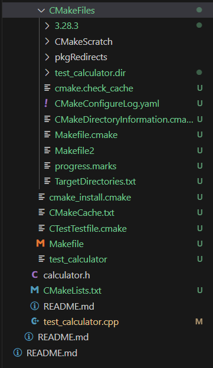

```
Laboratorio12/
├── CMakeLists.txt
├── calculator.h
├── test_calculator.cpp
├── build/

```
4. **Compilación y ejecución:**
```bash
mkdir build
cd build
cmake ..
make
./test_calculator

```

## Desarrollo práctico

### Estructura del proyecto

```
ie0417/
└── semanas/
    └── semana12/
        └── Laboratorio12/
            ├── calculator.h
            ├── test_calculator.cpp
            ├── CMakeLists.txt
            ├── README.md
            └── build/


```

### Código fuente

- Imagen calculator.h

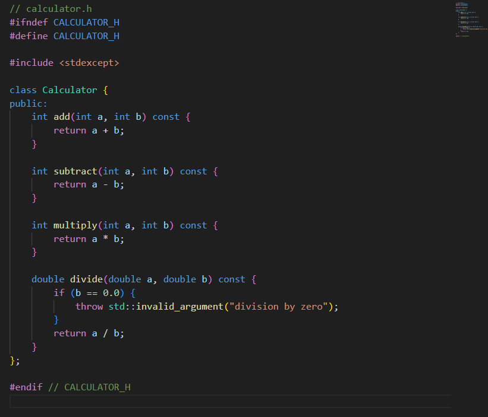

- Imagen test_calculator.cpp

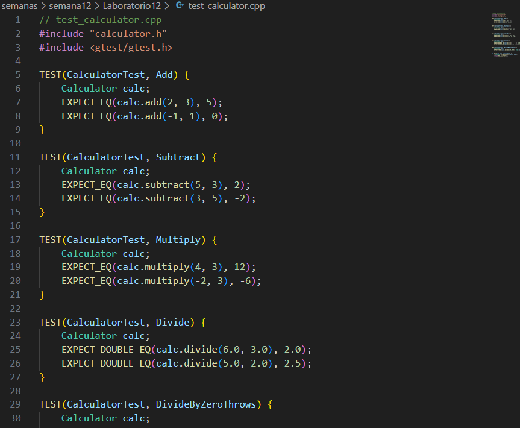

- Imagen CMakeLists.txt

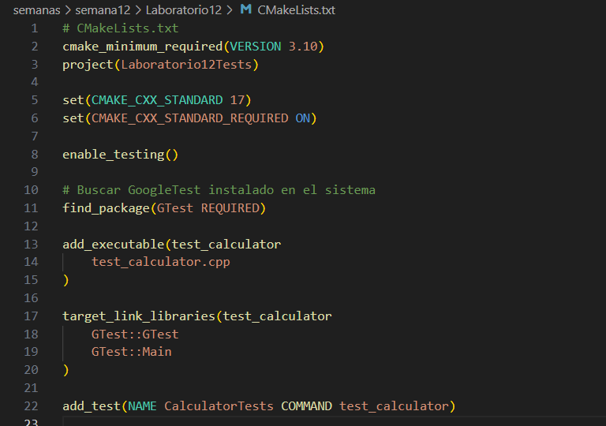

### Compilación y ejecución

Se realió la complicion en ubuntu y se descargo lo necesario para que funicione correctamente.

```
sudo apt-get update
sudo apt-get install -y cmake build-essential libgtest-dev
cd /usr/src/googletest || cd /usr/src/gtest
sudo cmake .
sudo make
sudo cp lib/*.a /usr/lib

```
### Compilación del proyecto:

```
cd ~/ie0417/semanas/semana12/Laboratorio12
mkdir build
cd build
cmake ..
make
./test_calculator

```
### imagen de salida

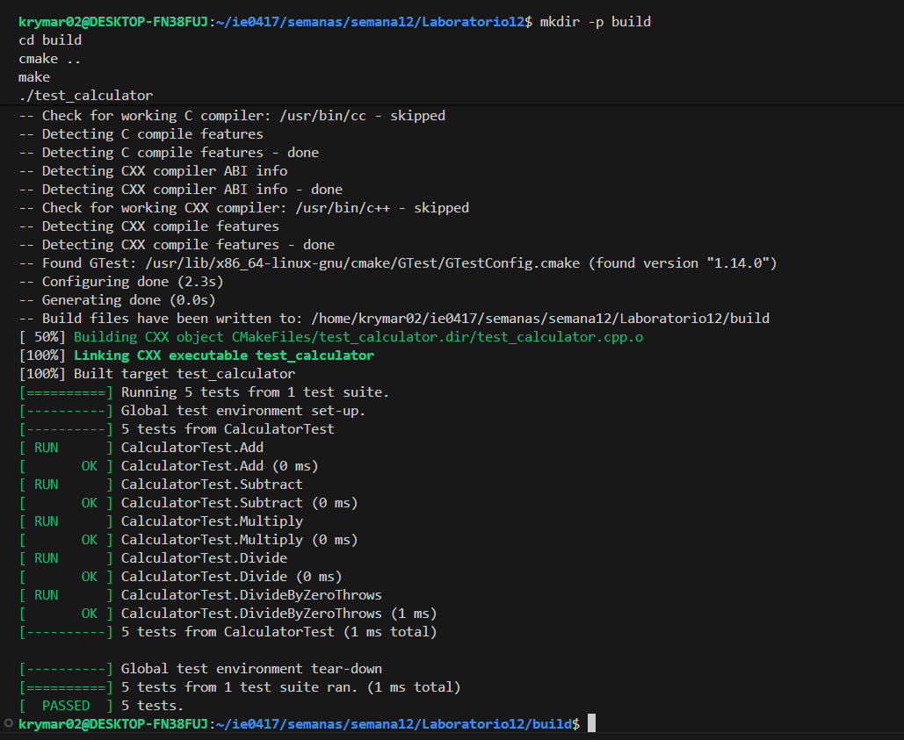

## Integración con CI/CD

- Imagen de .github/workflows/ci-cd.yml

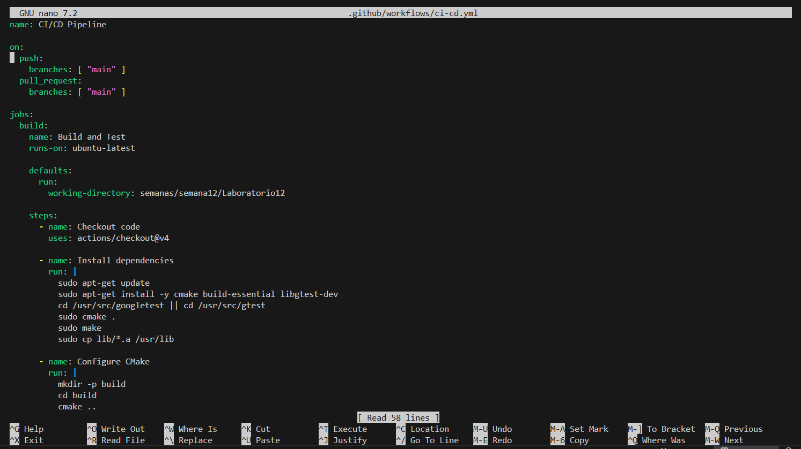

- Al realizar git push a la rama main, GitHub ejecuta las pruebas automáticamente y muestra el resultado en la pestaña Actions.

- Imagen de la pestaña actions
    -Se presentó un error pero al corregirlo con un .gitignore funcionó.

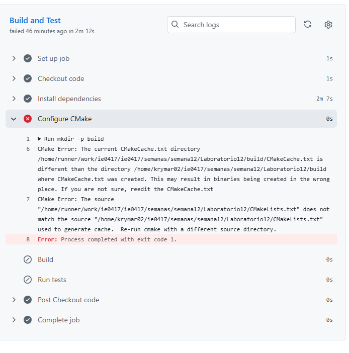

- Salida:

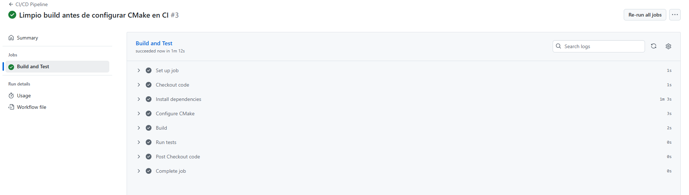

## Análisis y conclusiones

- Se logró configurar correctamente la infraestructura de pruebas automatizadas.

- Todos los tests se ejecutaron con éxito, validando las funciones implementadas.

- La integración con GitHub Actions garantiza la integridad continua del código.

- La práctica demuestra cómo las pruebas funcionales y unitarias fortalecen la calidad del software.

- GoogleTest facilita la creación de pruebas legibles y mantenibles para proyectos C++

## Evidencias gráficas

- Compilación y ejecución local

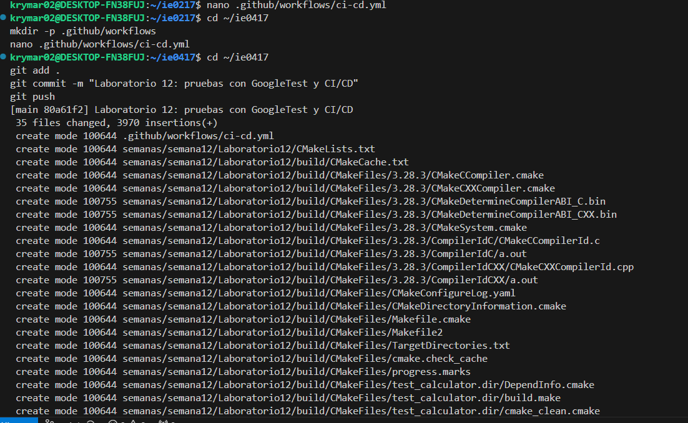


- Ejecución en GitHub Actions


- Carpetas finales

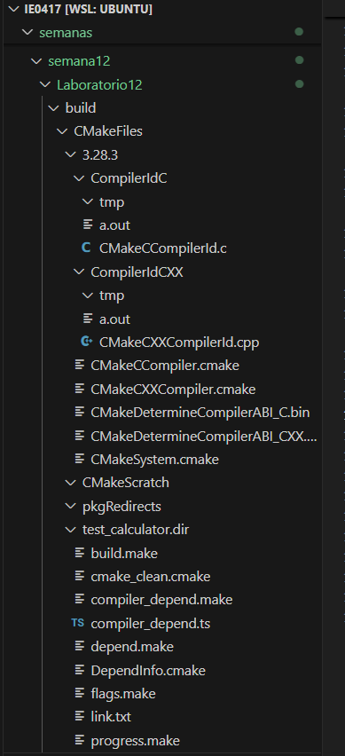

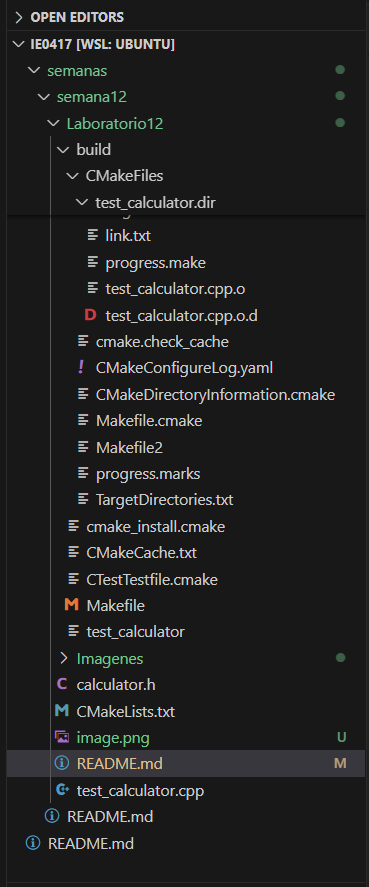