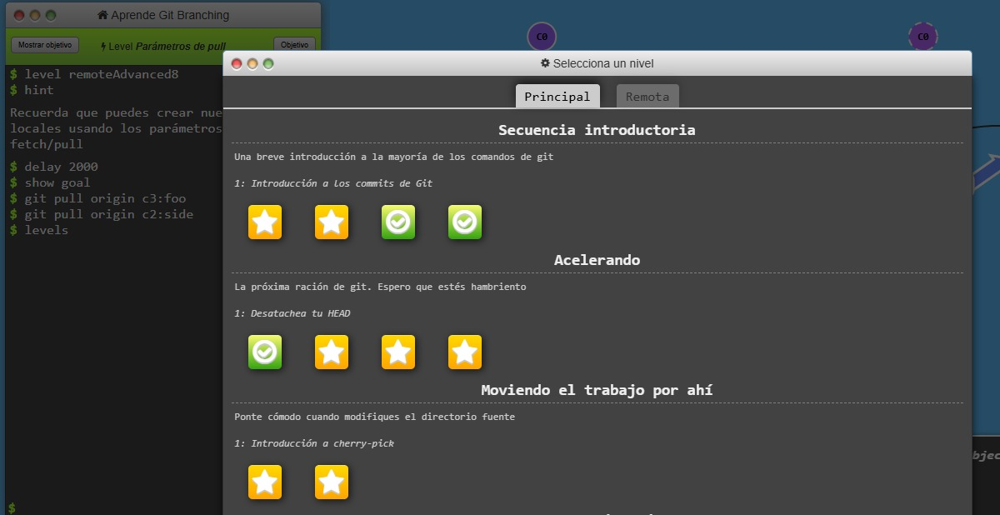
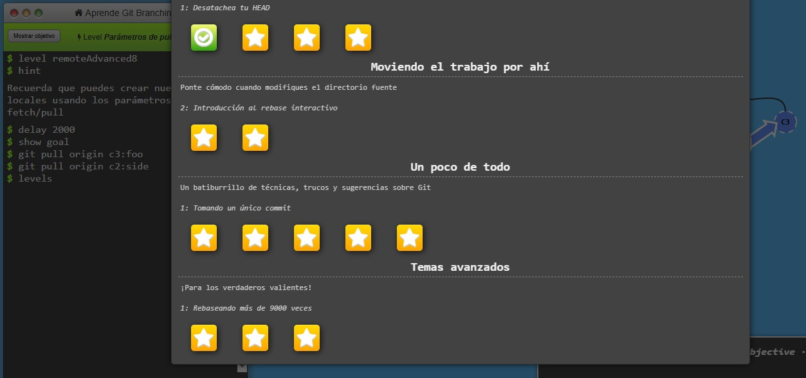
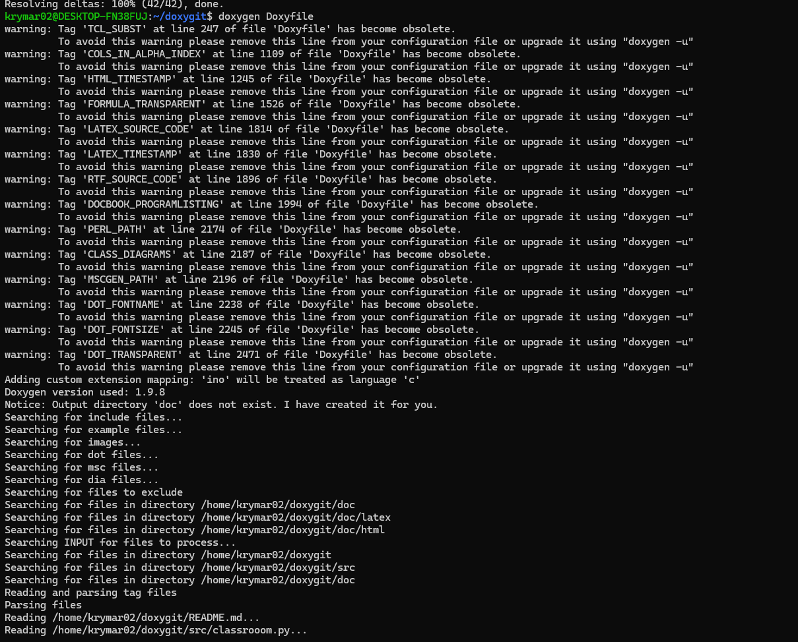
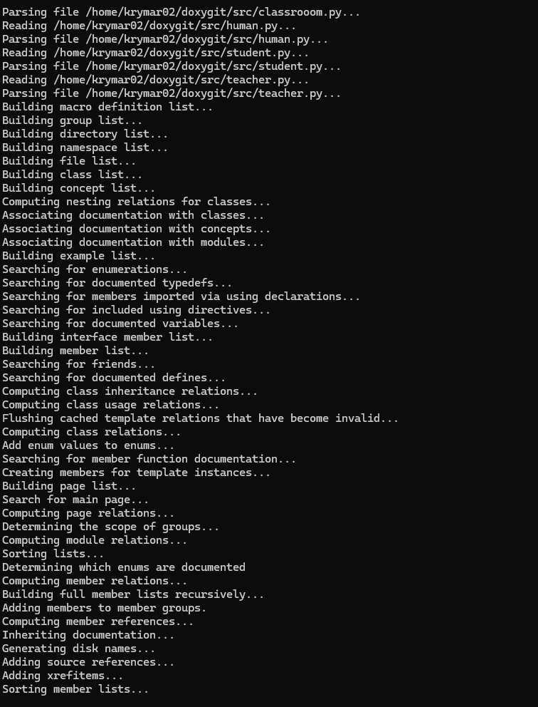
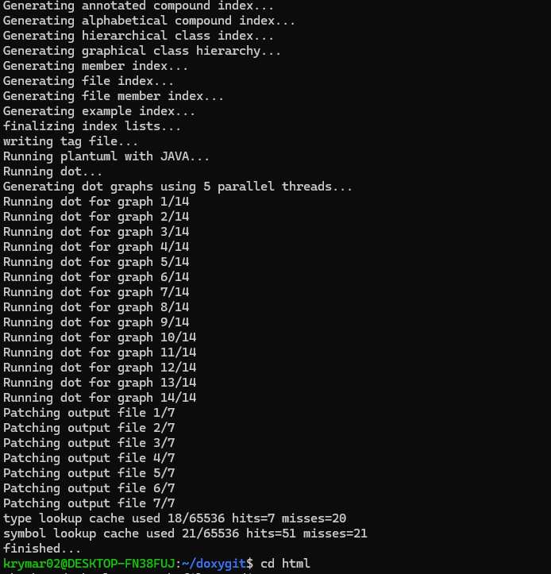
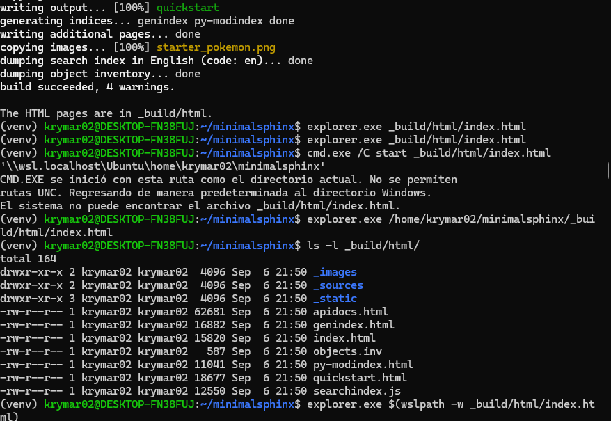
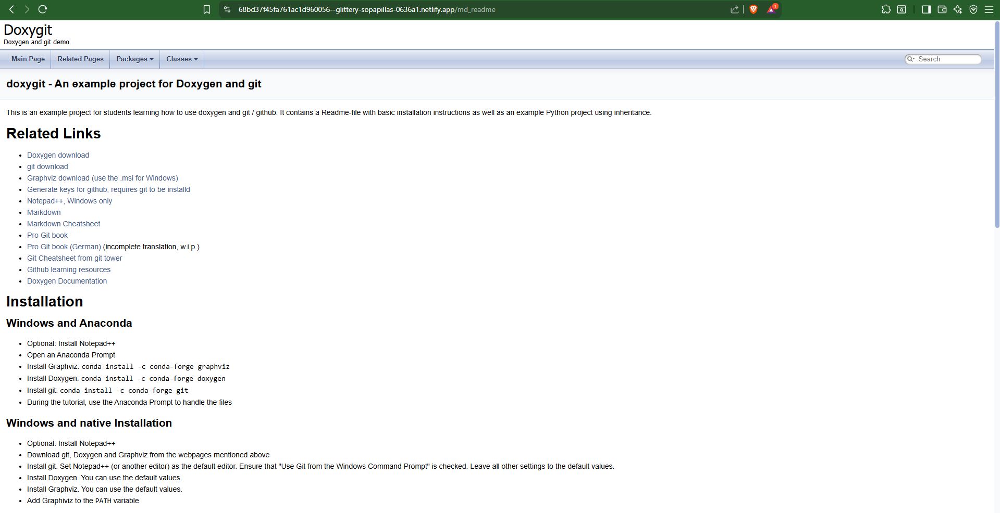
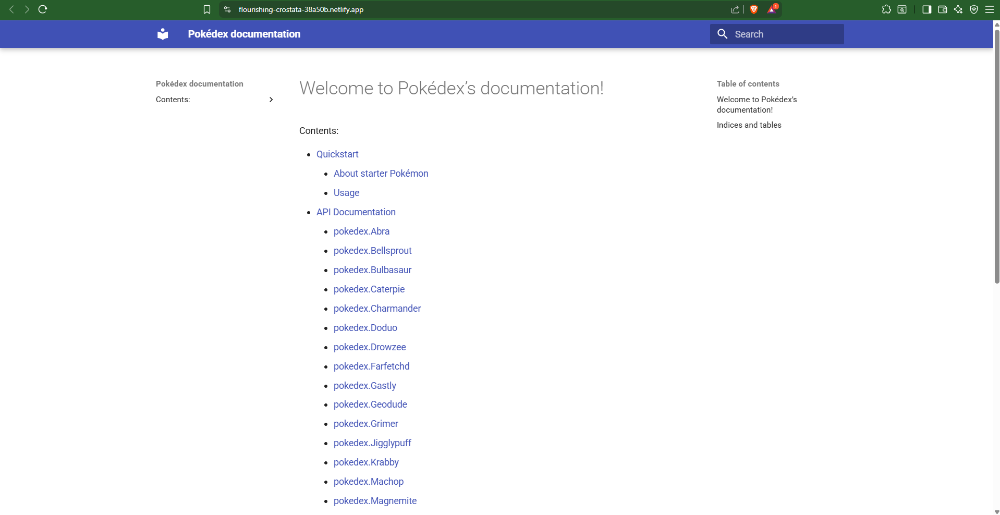

# Tarea Semana 4 - Clase 2  
**Actividad:** Control de versiones y documentación de software  
**Estudiante:** Kryssia Martínez  

---

## Índice
- [Parte 1: Git](#parte-1-git)
- [Parte 2: Doxygen](#parte-2-doxygen)
- [Parte 3: Sphinx](#parte-3-sphinx)
- [Parte 4: Publicación](#parte-4-publicación)

---

## Parte 1: Git

Las capturas de pantalla que demuestran la finalización de los ejercicios se encuentran en la carpeta:  
[Carpeta de imágenes](imágenes/)

Dentro de esta carpeta hay dos subcarpetas:

- [Carpeta de imágenes/remoto](imágenes/remoto) → contiene las capturas relacionadas con los ejercicios de la parte remota.  
- [Carpeta de imágenes/principal](imágenes/principal) → contiene las capturas relacionadas con los ejercicios de la parte principal.

**Capturas de pantalla de la finalización de los ejercicios:**

- **Parte 1 Principal:**  
    
  

- **Parte 2 Remoto:**  
  

---

## Parte 2: Doxygen

Repositorio utilizado para documentar Doxygen:  
- `https://github.com/ComNets-Bremen/doxygit`

**Capturas de documentación generada en local:**  
    
    
  

---

## Parte 3: Sphinx

Repositorio utilizado para documentar Sphinx:  
- `https://github.com/melissawm/minimalsphinx`

**Captura de documentación generada en local:**  
  

---

## Parte 4: Publicación

**Capturas de las páginas publicadas:**

- **Doxygen:**  
  - URL pública de Doxygen:  
    `https://glittery-sopapillas-0636a1.netlify.app`  
  - Página de Doxygen:  
    

- **Sphinx:**  
  - URL pública de Sphinx:  
    `https://flourishing-crostata-38a50b.netlify.app`  
  - Página de Sphinx:  
    

---

