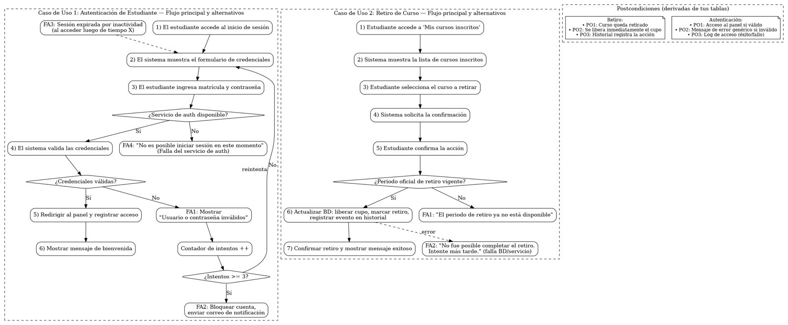

# Laboratorio 5.1 Semana 5 Clase 2  
**Trabajo Grupal**  

**Integrantes:**  
- Kryssia Martinez  
- María José Guevara Matarrita  
- Daylan Pereira Arroyo  

En este readme se presenta un análisis de requerimientos y modelado de casos de uso de un **Sistema de inscripción a cursos universitarios**.  

---

## Índice  

- [A. Requerimientos](#a-requerimientos)  
  - [Requerimientos funcionales (FR)](#requerimientos-funcionales-fr)  
  - [Requerimientos no funcionales (NFR)](#requerimientos-no-funcionales-nfr)  
  - [Requerimientos técnicos / de interfaz (TR)](#requerimientos-técnicos--de-interfaz-tr)  
- [B. Casos de uso detallados](#b-casos-de-uso-detallados)  
  - [Caso 1. Retiro de curso](#caso-1-retiro-de-curso)  
  - [Caso 2. Autenticación de estudiante](#caso-2-autenticación-de-estudiante)  
- [C. Diagrama UML](#c-diagrama-uml)  

---

## A. Requerimientos  

### Requerimientos funcionales (FR)

**FR-01. Autenticación de estudiante**  
El sistema debe permitir iniciar sesión con matrícula y contraseña, validando credenciales contra el servicio de autenticación.  
*Criterios de aceptación:*  
- Si credenciales son válidas → acceso al panel en ≤2 s.  
- Si no lo son → mensaje “usuario o contraseña inválidos” sin revelar cuál falló.  

**FR-02. Búsqueda de cursos**  
El estudiante puede buscar cursos por nombre, sigla, profesor, horario o modalidad.  
*Criterios de aceptación:*  
- Los filtros pueden combinarse.  
- La lista muestra: sigla, nombre, profesor, grupo, horario, modalidad y cupos.  

**FR-03. Validación de prerrequisitos**  
Antes de permitir la inscripción, el sistema verifica que el estudiante cumpla los prerrequisitos.  
*Criterios de aceptación:*  
- Si falta algún prerrequisito → bloquea inscripción y muestra cuáles faltan.  

**FR-04. Control de cupos**  
El sistema debe impedir inscripciones cuando no existan cupos disponibles.  
*Criterios de aceptación:*  
- Disminuye cupo en 1 tras inscripción exitosa.  
- Si otro usuario tomó el último cupo entre la selección y la confirmación → error y sugerir otros grupos.  

**FR-05. Detección de traslapes**  
El sistema impide inscribirse en cursos con choque de horario.  
*Criterios de aceptación:*  
- Si hay traslape con una materia ya inscrita → bloquea y sugiere otros grupos sin choque.  

**FR-06. Inscripción y confirmación**  
El estudiante puede inscribirse a uno o más cursos dentro del periodo habilitado.  
*Criterios de aceptación:*  
- Tras confirmar, registra la matrícula y muestra comprobante con folio/ID.  
- El comprobante queda disponible para descarga/consulta.  

**FR-07. Retiro de curso**  
El estudiante puede cancelar la inscripción dentro del periodo de retiro.  
*Criterios de aceptación:*  
- Al retirar, se libera el cupo de inmediato y queda registro en el historial.  

**FR-08. Consulta de oferta en tiempo real**  
Mostrar la oferta académica con cupos actualizados.  
*Criterios de aceptación:*  
- F5/recargar refleja cambios de cupo sin requerir nueva sesión.  
- Si el curso ya está inscrito, indicar “Ya matriculado”.  

---

### Requerimientos no funcionales (NFR)

**NFR-01. Desempeño**  
Las operaciones de búsqueda, inscripción y retiro deben completarse en ≤2 s en condiciones nominales (hasta 500 usuarios concurrentes).  

**NFR-02. Concurrencia y consistencia**  
El sistema debe manejar concurrencia sin inscripciones duplicadas ni cupos negativos.  

**NFR-03. Compatibilidad y accesibilidad**  
Funciona en navegadores modernos y es usable en móviles; cumple WCAG 2.1 AA para elementos críticos.  

**NFR-04. Seguridad**  
Las credenciales y sesiones se gestionan de forma segura (HTTPS, contraseñas cifradas, sesiones expiran por inactividad).  

---

### Requerimientos técnicos / de interfaz (TR)

**TR-01. Pila tecnológica de interfaz**  
La UI se implementa con HTML/CSS/JavaScript; se puede usar **React** para interactividad.  

**TR-02. API y transaccionalidad**  
El backend expone endpoints REST/GraphQL con manejo transaccional en BD.  

**TR-03. Registro y trazabilidad**  
Todas las operaciones de inscripción/retiro quedan registradas con timestamp y usuario para auditoría.  

---

## B. Casos de uso detallados  

### Caso 1. Retiro de curso  

**Actor principal:**  
- Estudiante  

**Interesados y objetivos**  

| Interesado   | Objetivo |
|--------------|----------|
| Estudiante   | Desea cancelar un curso dentro del periodo permitido. |
| Universidad  | Quiere mantener actualizado el control de cupos y registro histórico. |

**Precondiciones**  

| ID | Condición |
|----|-----------|
| P1 | El estudiante debe tener una cuenta activa y autenticada. |
| P2 | Necesita al menos un curso inscrito. |
| P3 | El periodo oficial de retiro está vigente. |

**Postcondiciones**  

| ID | Resultado |
|----|-----------|
| PO1 | El curso queda retirado para el estudiante. |
| PO2 | Se libera inmediatamente el cupo que tenia el estudiante. |
| PO3 | El historial académico registra la acción y queda listo. |

**Flujo principal**  

| Paso | Acción |
|------|--------|
| 1 | El estudiante accede a la sección **Mis cursos inscritos**. |
| 2 | El sistema muestra la lista de cursos inscritos. |
| 3 | El estudiante puede seleccionar el curso a retirar. |
| 4 | El sistema solicita la confirmación del curso. |
| 5 | El estudiante confirma la acción. |
| 6 | El sistema actualiza la BD (libera cupo, marca retiro, registra evento). |
| 7 | El sistema confirma el retiro e imprime un mensaje exitoso. |

**Flujos alternativos**  

| ID | Alternativa | Acción del sistema |
|----|-------------|--------------------|
| FA1 | Que el periodo de retiro este cerrado | Mostrar mensaje: *“El periodo de retiro ya no está disponible”*. |
| FA2 | Una falla en base de datos | Mostrar: *“No fue posible completar el retiro. Intente más tarde.”*. |

---

### Caso 2. Autenticación de estudiante  

**Actor principal:**  
- Estudiante  

**Interesados y objetivos**  

| Interesado   | Objetivo |
|--------------|----------|
| Estudiante   | Poder acceder al sistema de una forma segura. |
| Universidad  | Que pueda garantizar que solo usuarios autorizados gestionen inscripciones de cursos. |

**Precondiciones**  

| ID | Condición |
|----|-----------|
| P1 | El estudiante debe tener su cuenta activa. |
| P2 | Debe poseer credenciales válidas (matrícula y contraseña en este caso). |

**Postcondiciones**  

| ID | Resultado |
|----|-----------|
| PO1 | Si es válido, el estudiante puede acceder al panel principal. |
| PO2 | Si es inválido, recibe un mensaje de error genérico. |
| PO3 | Se registra un log de acceso (ya sea exitoso o fallido). |

**Flujo principal**  

| Paso | Acción |
|------|--------|
| 1 | El estudiante procede a acceder al inicio de sesión. |
| 2 | El sistema muestra el formulario de credenciales uduario y contraseña. |
| 3 | El estudiante ingresa matrícula y contraseña. |
| 4 | El sistema valida las credenciales que se registraron. |
| 5 | Si son correctas, se redirige al panel principal y registra el acceso. |
| 6 | Se muestra un mensaje de bienvenida. |

**Flujos alternativos**  

| ID | Alternativa | Acción del sistema |
|----|-------------|--------------------|
| FA1 | Si las credenciales son inválidas | Mostrar: *“Usuario o contraseña inválidas”*. |
| FA2 | Se procede a bloquear la cuenta | Tras 3 intentos fallidos, bloquear cuenta y enviar un correo. |
| FA3 | Sesión expirada | Mostrar: *“Su sesión ha expirado por inactividad”*. |
| FA4 | Falla del servicio de autenticación | Mostrar: *“No es posible iniciar sesión en este momento”*. |

---

## C. Diagrama UML  
- Diagrama con relación «include», relación «extend» y generalización.
  

---

