Semana 8 
Kryssia Martinez
Laboratorio 8.2 
Tema: Laboratorio de Contenedores

Docker: de cero a capas (con flask)

A Repaso de Conceptos 
- Imagen: plantilla inmutable (solo lectura) hecha de capas. Cada instrucción del Dockerfile
suele producir una capa nueva. Se almacenan en un sistema “copy-on-write”.
- Contenedor: una instancia en ejecución de una imagen, con su capa superior de escritura
para cambios temporales.
- Capas y caché: si Docker detecta que una instrucción y sus inputs no cambiaron, reusa la
capa cacheada y evita rehacer trabajo. Orden y granularidad importan.

B Prerequisitos 

- Docker instalado (docker --version debe responder).
- Editor de texto (VS Code, etc.).
- curl para probar endpoints desde terminal

C Desarrollo
1. Instalacion de Docker y clonar repo
En esta primera parte se realizo la instalacion de Docker y curl para probar los endpoinst desde la terminal. - Tambien se clonó el repositorio, para subir commits individuales de cada cambio. 

Imagen de la instalacion exitosa de Docker

2. Estructura para el proyecto 
Se crearo una carpeta llamada docker-por-capas dentro de Semanas/Semana8/Laboratorios/Laboratorio8.2/docker-por-capas/

Dentro de esa carpeta se encuentran los siguientes archivos  
app.py :  Permitirá ver el contenedor respondiendo y manipular env vars.
requirements.txt : Declara dependencias Python. Separarlo del código ayuda al caché.
Dockerfile : Se constituyen las capas en las que se va trabajando

.dockerignore : Excluye archivos del contexto de build (lo que Docker manda al daemon para construir). Menos contexto = builds más rápidos y capas más pequeñas.

docker-por-capas/
├─ app.py
├─ requirements.txt
├─ Dockerfile
└─ .dockerignore

Imagen de la estructura 

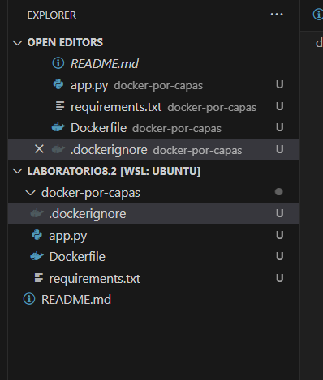

3. Construccion y observacion de Capas

a. Primero se utilizó docker build -t capas-flask:1.0 . para construit capas secuencialmente.

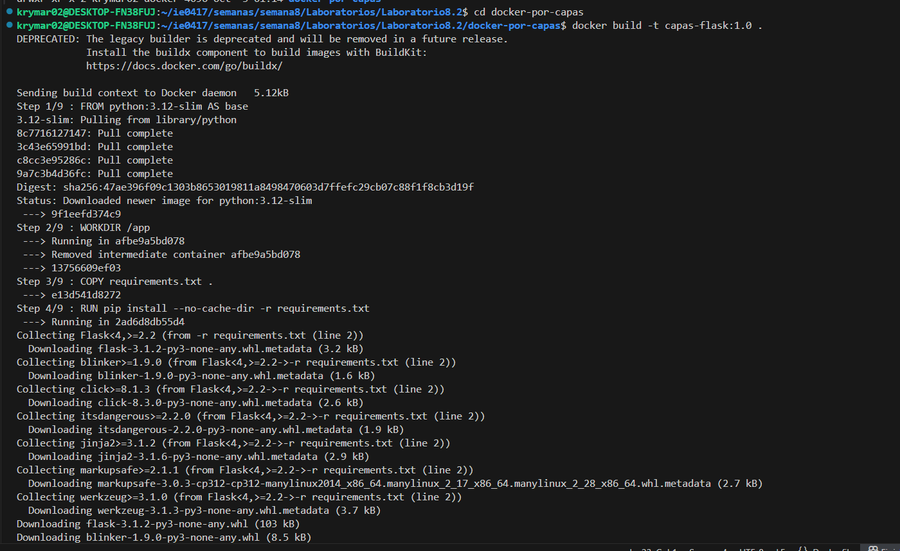

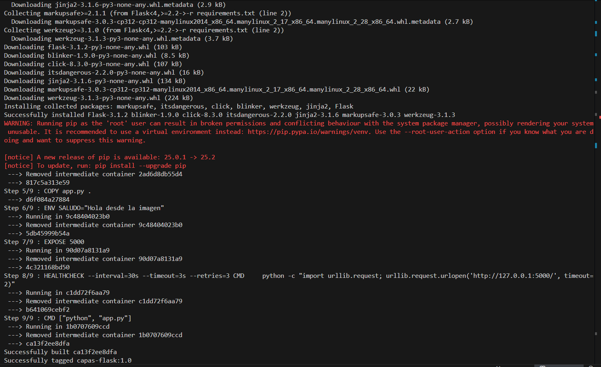

Resultado: En esta parte, la imagen capas-flask:1.0 se construyó correctamente y todas las capas se ejecutaron de manera adecuada.

b. Luego se usa docker history capas-flask:1.0 para ver el historial de las capas. 

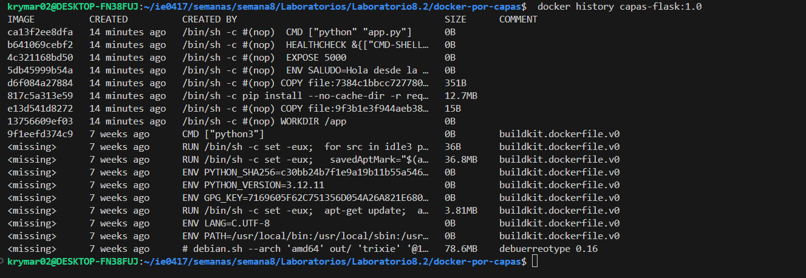

Resultado: Se muestra cada capa, su tamaño y la instrucción que la generó. Ayuda a explicar por qué conviene separar requirements.txt del código

c. Posteriormente se usa docker run --name demo-capas -d -p 5000:5000 capas-flask:1.0 para ejecutar el contenedor. 

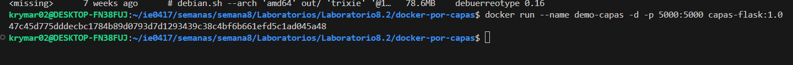

d. En la parte de Networking docker crea una red (bridge). El contenedor escucha en 0.0.0.0:5000 dentro del contenedor; con
-p rediriges tráfico del host al contenedor.

Resultado: Se usa en la consola curl http://localhost:5000 y desde internet http://localhost:5000 se muestra  {"ok": true, "mensaje": "Hola desde la imagen"}.
-Consola:
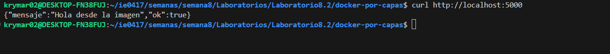

-Internet:

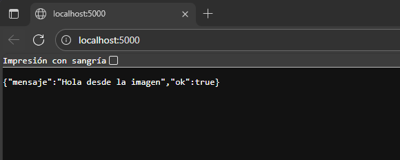

e. Aca vamos a ver el estado, logs y health.
    - Ejecucion de docker ps
docker logs -f demo-capas
docker inspect demo-capas --format '{{.State.Health.Status}}'
Si el HEALTHCHECK falla, verás unhealthy. Revisa logs o el endpoint

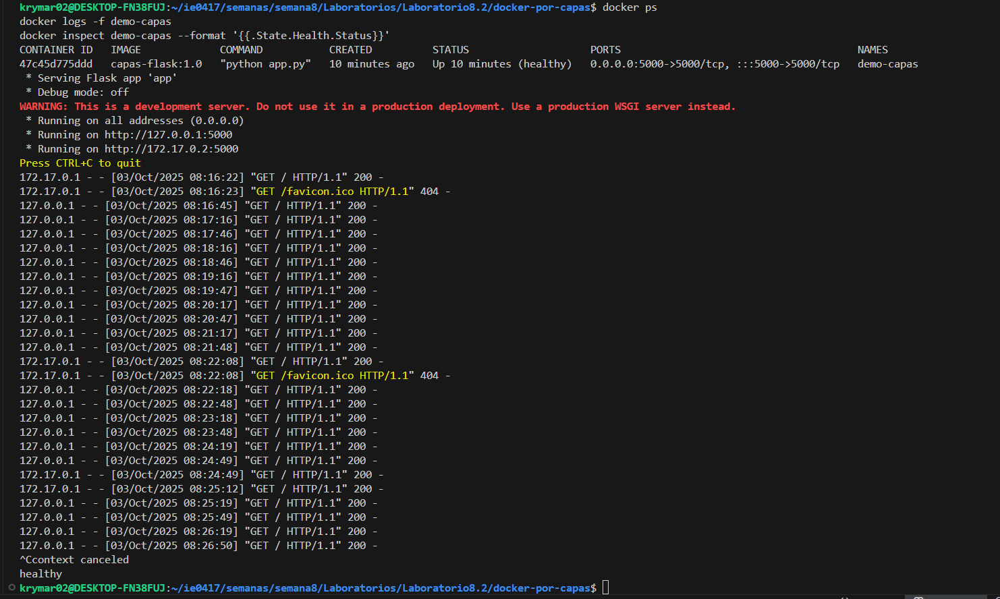

    - Ejecucion de para detener y limpiar, se usó docker stop demo-capas
docker rm demo-capas

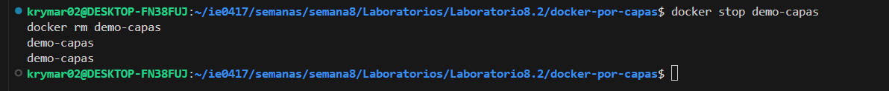

f. En esta parte se hace una demostracion del caché.
    - Se reconstruyó con docker build -t capas-flask:1.1 .

    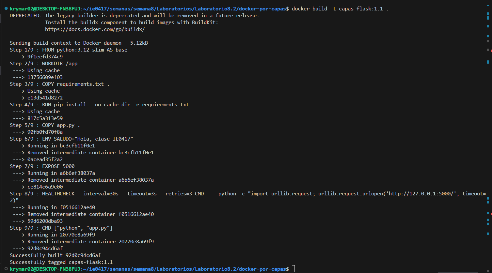

    - Se cambio en requirements.txt (por ejemplo a flask==3.0.2) y se econstruyó con docker build -t capas-flask:1.2 .

    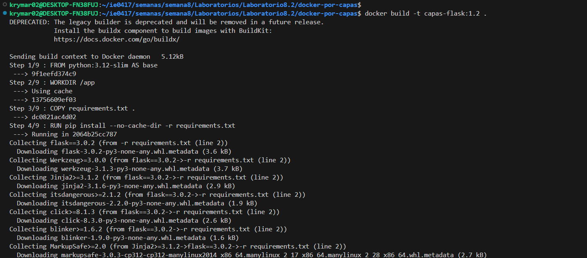

    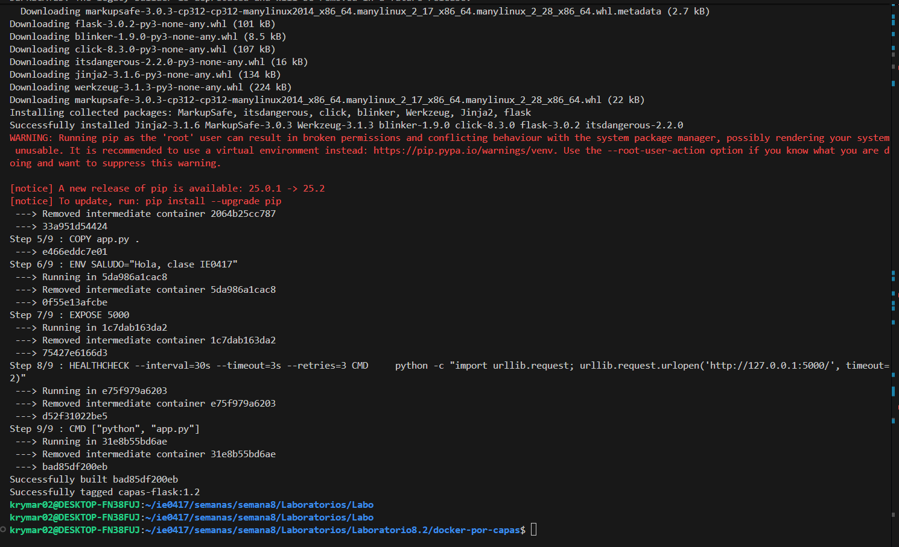

    Resultado: Se invalida la capa de pip install y todo lo posterior.

g. Variables de entorno (ENV) y prioridad

    - En esta parte se tiene un valor por defecto,  en la imagen: ENV SALUDO="...". En run, -e tiene prioridad (sobrescribe lo de la imagen) con docker run --rm -p 5000:5000 -e SALUDO="Hola desde run" capas-flask:1.2

   -Consola:
    
    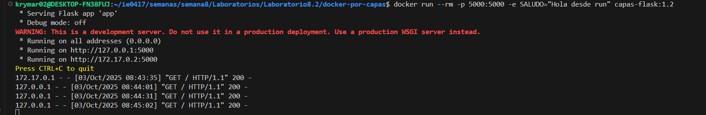

    - Salida en internet: 

    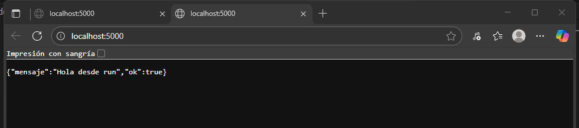

    - Tambien se podia realizar desde un archivo .env, se creó el archivo y se ejecutó con docker run --rm -p 5000:5000 --env-file .env capas-flask:1.2 

    - Consola:
    
    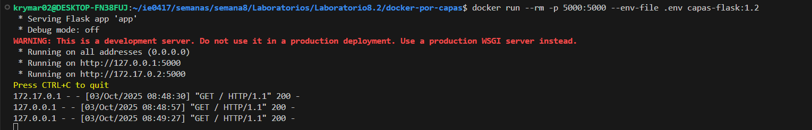

    - Salida en internet: 

    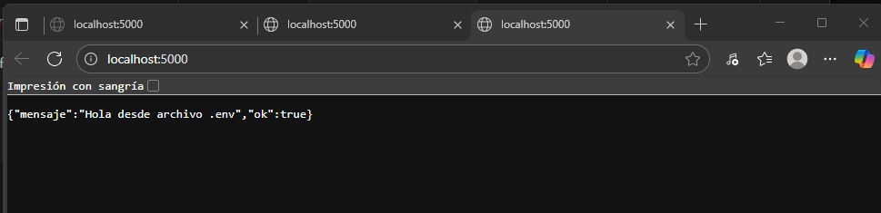

h. Prueba rápida (sin cambiar nada en la imagen actual):

    - Se ejecutó docker run --rm capas-flask:1.2 python -c "print('hola')".

    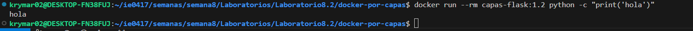

i. Volúmenes :
    - En esta parte el objetivo es editar código en el host y que el contenedor lo vea en caliente (sin reconstruir). Se creó un file llamado Dockerfile.dev con su contenido.
    - Luego se ejecutó  docker build -f Dockerfile.dev -t capas-flask:dev .

    -Consola:

    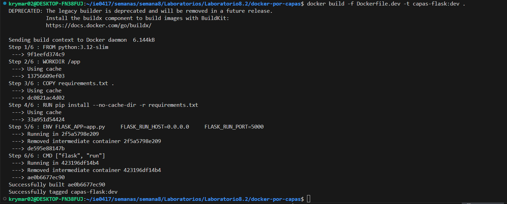

    - Salida en internet:

    

    - Luego en windows se corrió lo siguiente: docker run --name dev-capas -d -p 5000:5000 -v "${PWD}:/app" capas-flask:dev

    -Consola:

    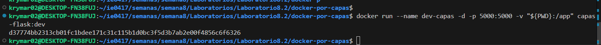

    - Salida en internet:

    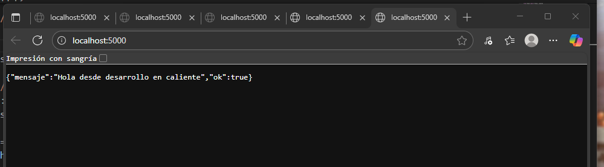

