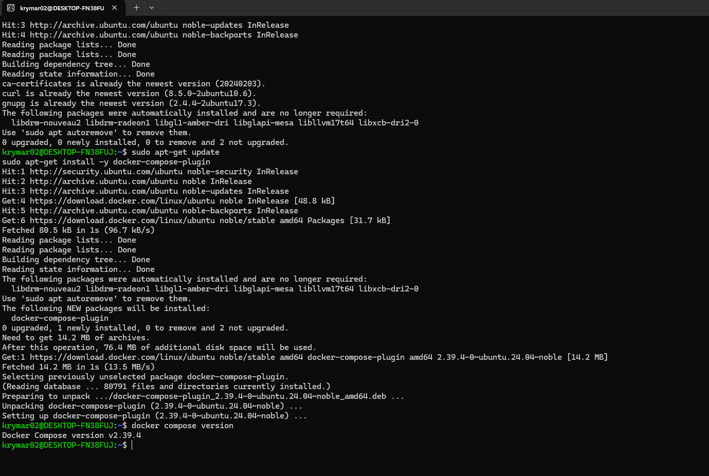
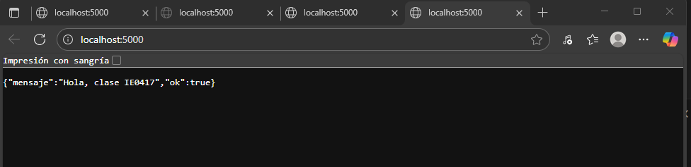
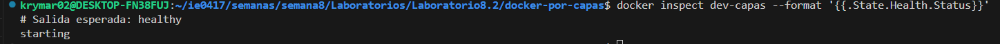

# Semana 8  
**Kryssia Martinez**  
**Laboratorio 8.2**  
**Tema:** Laboratorio de Contenedores  

## Docker: de cero a capas (con Flask)

### A Repaso de Conceptos 
- **Imagen:** plantilla inmutable (solo lectura) hecha de capas. Cada instrucción del Dockerfile suele producir una capa nueva. Se almacenan en un sistema “copy-on-write”.  
- **Contenedor:** una instancia en ejecución de una imagen, con su capa superior de escritura para cambios temporales.  
- **Capas y caché:** si Docker detecta que una instrucción y sus inputs no cambiaron, reusa la capa cacheada y evita rehacer trabajo. Orden y granularidad importan.  

### B Prerrequisitos 
- Docker instalado (`docker --version` debe responder).  
- Editor de texto (VS Code, etc.).  
- curl para probar endpoints desde terminal  

### C Desarrollo

#### 1. Instalación de Docker y clonar repo
En esta primera parte se realizó la instalación de Docker y curl para probar los endpoints desde la terminal. También se clonó el repositorio, para subir commits individuales de cada cambio.  

**Imagen de la instalación exitosa de Docker**  

  

#### 2. Estructura para el proyecto 
Se creó una carpeta llamada `docker-por-capas` dentro de `Semanas/Semana8/Laboratorios/Laboratorio8.2/docker-por-capas/`  

Dentro de esa carpeta se encuentran los siguientes archivos:  
- `app.py` : Permitirá ver el contenedor respondiendo y manipular env vars.  
- `requirements.txt` : Declara dependencias Python. Separarlo del código ayuda al caché.  
- `Dockerfile` : Se constituyen las capas en las que se va trabajando  
- `.dockerignore` : Excluye archivos del contexto de build (lo que Docker manda al daemon para construir). Menos contexto = builds más rápidos y capas más pequeñas.  


```markdown
Laboratorio8.2/
└─ docker-por-capas/
   ├─ app.py
   ├─ requirements.txt
   ├─ Dockerfile
   ├─ Dockerfile.dev
   ├─ .dockerignore
   └─ ImagenesDocker/
    
```


**Imagen de la estructura**  

  

#### 3. Construcción y observación de Capas

a. Primero se utilizó `docker build -t capas-flask:1.0 .` para construir capas secuencialmente.  

  
  

**Resultado:** En esta parte, la imagen `capas-flask:1.0` se construyó correctamente y todas las capas se ejecutaron de manera adecuada.  

b. Luego se usa `docker history capas-flask:1.0` para ver el historial de las capas.  

  

**Resultado:** Se muestra cada capa, su tamaño y la instrucción que la generó. Ayuda a explicar por qué conviene separar `requirements.txt` del código.  

c. Posteriormente se usa `docker run --name demo-capas -d -p 5000:5000 capas-flask:1.0` para ejecutar el contenedor.  

  

d. En la parte de Networking, Docker crea una red (bridge). El contenedor escucha en `0.0.0.0:5000` dentro del contenedor; con `-p` rediriges tráfico del host al contenedor.  

**Resultado:**  
Se usa en la consola `curl http://localhost:5000` y desde internet `http://localhost:5000` se muestra `{"ok": true, "mensaje": "Hola desde la imagen"}`.  

- Consola:  
  

- Internet:  
  

e. Estado, logs y health:  
- Ejecución de `docker ps`  
- `docker logs -f demo-capas`  
- `docker inspect demo-capas --format '{{.State.Health.Status}}'`  

Si el HEALTHCHECK falla, verás `unhealthy`. Revisa logs o el endpoint.  

  

- Para detener y limpiar:  
`docker stop demo-capas`  
`docker rm demo-capas`  

  

f. Demostración del caché:  
- Se reconstruyó con `docker build -t capas-flask:1.1 .`  

  

- Se cambió `requirements.txt` (por ejemplo a `flask==3.0.2`) y se reconstruyó con `docker build -t capas-flask:1.2 .`  

  
  

**Resultado:** Se invalida la capa de `pip install` y todo lo posterior.  

g. Variables de entorno (ENV) y prioridad:  
- Valor por defecto en la imagen: `ENV SALUDO="..."`.  
- En `run`, `-e` tiene prioridad: `docker run --rm -p 5000:5000 -e SALUDO="Hola desde run" capas-flask:1.2`  

Consola:  
  

Salida en internet:  
  

- También se puede realizar desde un archivo `.env`:  
`docker run --rm -p 5000:5000 --env-file .env capas-flask:1.2`  

Consola:  
  

Salida en internet:  
  

h. Prueba rápida:  
`docker run --rm capas-flask:1.2 python -c "print('hola')"`  

  

i. Volúmenes:  
- Objetivo: editar código en el host y que el contenedor lo vea en caliente (sin reconstruir).  
- Se creó `Dockerfile.dev` y se ejecutó `docker build -f Dockerfile.dev -t capas-flask:dev .`  

Consola:  
  

Salida en internet:  
  

- En Windows: `docker run --name dev-capas -d -p 5000:5000 -v "${PWD}:/app" capas-flask:dev`  

Consola:  
  

Salida en internet:  
  

**Resultado:** se refrescó el navegador y se observaron los cambios.  

j. Healthcheck (qué evalúa y cuándo):  
- El HEALTHCHECK corre periódicamente el comando indicado.  
- Si retorna `0` → `healthy`.  
- Si retorna ≠ 0 o se excede timeout → `unhealthy` tras retries fallidos.  

Para ver el estado:  
`docker inspect dev-capas --format '{{.State.Health}}'`  

  

#### 4. Docker Compose
- Se crea un archivo `docker-compose.yml` con su contenido respectivo.


